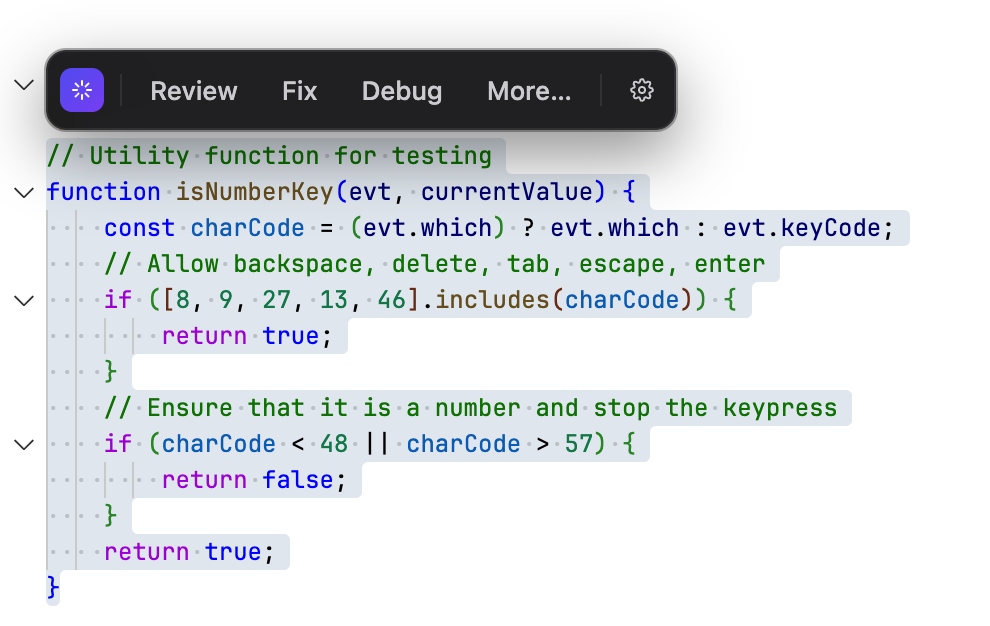
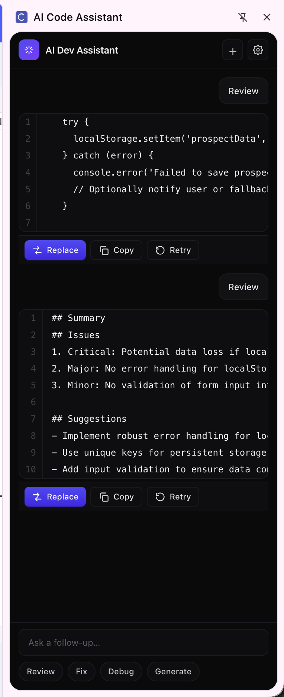

# AI Code Assistant — Chrome Extension

A Chrome MV3 extension that brings AI-powered code actions directly into any web editor. Select code, click an action, get streaming results in a side panel — no copy-paste required.

## Screenshots

### Context Menu Toolbar
Select code on any page and a floating toolbar appears with quick actions:



### Side Panel Results
Results stream into the side panel with code blocks, Replace/Copy/Retry controls, and multi-turn follow-ups:



## How It Works

```
content script (Shadow-DOM tooltip)
  ──port──▶ service worker
              ──fetch──▶ provider API (OpenAI / Anthropic / Local)
              ──port──▶ side panel (React + diff view)
```

1. **Select code** in any textarea, Monaco, or CodeMirror editor
2. **Floating toolbar** appears — click Review, Fix, Debug, or Generate
3. **Side panel opens** with streaming AI response and code blocks
4. **Replace** writes back into the editor · **Copy** to clipboard · **Retry** reruns

Keyboard shortcut: `Cmd/Ctrl + Shift + A` runs **Improve** on the active selection.

## Setup

See [SETUP.md](SETUP.md) for full install, build, and provider configuration instructions.

### Quick Start

```bash
npm install
npm run dev
```

Load unpacked in Chrome: `chrome://extensions` → Developer mode → Load unpacked → select `dist/`

## Providers

Configure via the Options page:

| Provider | Default model |
|---|---|
| OpenAI | `gpt-4o-mini` |
| Anthropic | `claude-sonnet-4-6` |
| Local (Ollama / LM Studio) | `http://localhost:11434/v1` |

API keys are stored in `chrome.storage.local` and accessed only from the service worker — content scripts never see them.

## Architecture Highlights

- **Shadow DOM tooltip** — no style conflicts with host pages
- **Streaming responses** — SSE for OpenAI-compat, native Anthropic event stream
- **Failover** — optional fallback provider on retriable errors
- **Cancellation** — panel/content disconnect aborts the in-flight fetch
- **Rate limiting** — token budget guard prevents runaway API usage
